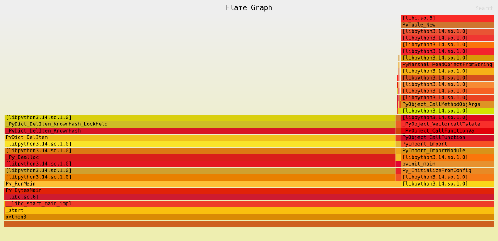
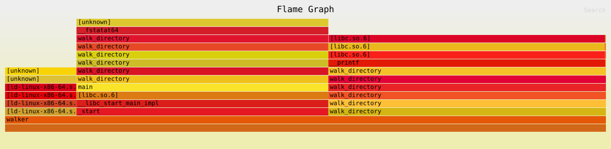

# `swiss-army-knife` is a Collection of Programming Tools in Four Languages
As I get more experience, I notice that there are repeated actions I take when
writing software, that, if I just had an example to use, 
it would go a lot faster.

Specifically, I'll be writing small scripts that perform the following tasks
in C, C++, Rust, and Python:
1. Walking a directory tree
2. Reading and writing files safely
3. Parsing CLI arguments
4. Serializing and deserializing JSON/CSV
5. Transforming collections
6. Building a lookup map or set
7. Attaching context to errors
8. Spawning work and joining it (concurrency/threading)
9. Writing a unit test and a fixture test
10. Structuring a small project (build directory conventions)
11. Calling a C API (FFI boundaries)
12. Managing pointer-plus-length raw data (raw buffer blocks)
13. Building and linking a native library (.a/.so compilation)

# Why there are flamegraphs for each tool

I thought as I got into it it might be a good time to get familiar with some
typical tools that are used in software performance engineering. So I made
some flamegraphs to compare the behavior of different languages!

For `walk_directory` I decided to showcase Python vs. C here.
For Python:

For C:

