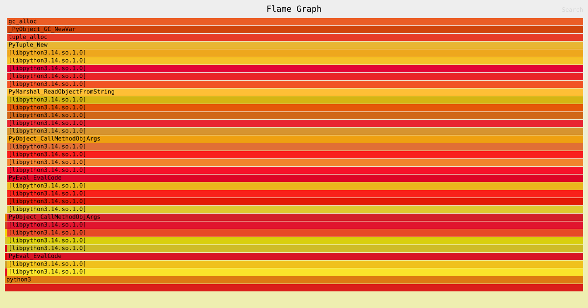
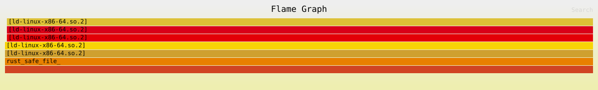
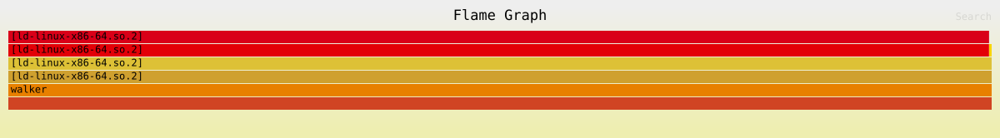
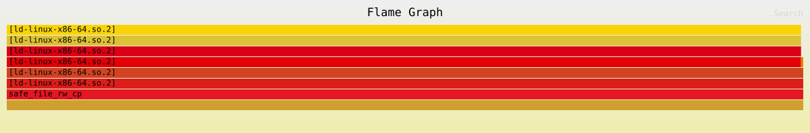

# `safe_file_rw`

Demonstrates how a file handle is properly opened,; buffered writes are 
flushed to disk, and resources are deterministically released.
Again, included flamegraphs and a comparison with `hyperfine`.
However do take the `hyperfine` results with a grain of salt, because for 
C, Rust, and C++ I got the following.
```
  Warning: Command took less than 5 ms to complete. Note that the results 
  might be inaccurate because hyperfine can not calibrate the shell startup 
  time much more precise than this limit. You can try to use the 
  `-N`/`--shell=none` option to disable the shell completely.
  
  Warning: Statistical outliers were detected. Consider re-running this 
  benchmark on a quiet system without any interferences from other programs. 
  It might help to use the '--warmup' or '--prepare' options.
```

| Command | Mean [ms] | Min [ms] | Max [ms] | Relative |
|:---|---:|---:|---:|---:|
| `python3 ./python_safe_file_rw/safe_file_rw.py` | 14.0 ± 0.7 | 12.7 | 16.4 | 59.75 ± 16.52 |
| `./rust_safe_file_rw/target/release/rust_safe_file_rw` | 0.4 ± 0.1 | 0.3 | 1.4 | 1.55 ± 0.52 |
| `./c_safe_file_rw/walker` | 0.2 ± 0.1 | 0.2 | 0.7 | 1.00 |
| `./cpp_safe_file_rw/safe_file_rw_cpp` | 0.6 ± 0.2 | 0.5 | 9.4 | 2.73 ± 1.14 |

## Python Flamegraph


## Rust Flamegraph


## C Flamegraph


## C++ Flamegraph

