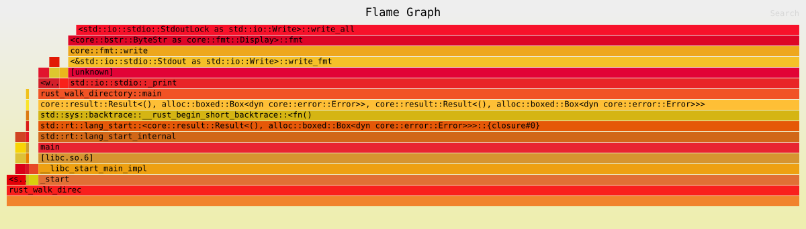
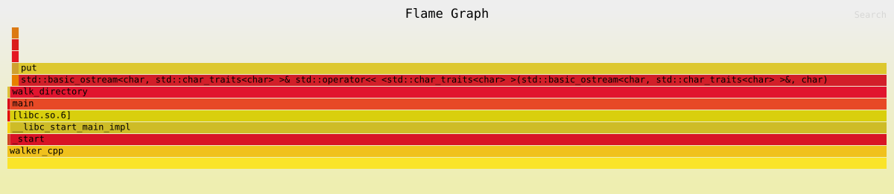

# `walk_directory`

As previously discussed, I wrote a script that walks through a directory 
structure and prints that to the terminal so when I need to walk a 
directory structure I can go back and look at these.

I've compared the performance of each command as well as their flamegraphs.
I used `hyperfine` to run a few warmup runs as well as get an average 
execution time on each script:

| Command | Mean [ms] | Min [ms] | Max [ms] | Relative |
|:---|---:|---:|---:|---:|
| `python3 ./python_walk_directory/os_walk.py ~/Downloads` | 55.6 ± 1.1 | 53.9 | 60.4 | 1.71 ± 0.06 |
| `./rust_walk_directory/target/release/rust_walk_directory ~/Downloads` | 32.4 ± 0.9 | 30.4 | 35.0 | 1.00 |
| `./c_walk_directory/walker ~/Downloads` | 41.3 ± 0.8 | 39.8 | 44.1 | 1.27 ± 0.04 |
| `./cpp_walk_directory/walker_cpp ~/Downloads/` | 49.5 ± 0.9 | 48.0 | 53.1 | 1.53 ± 0.05 |

## Python Flamegraph

## Rust Flamegraph

## C Flamegraph

## C++ Flamegraph

